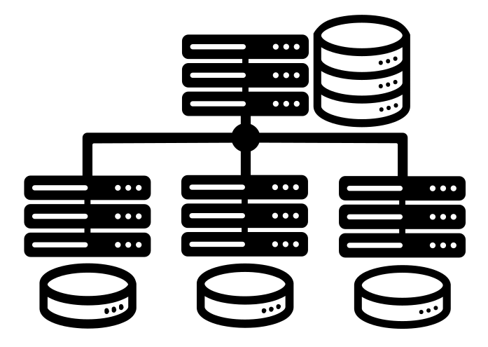

# MIT 6.824 Distributed Systems
Labs and related materials from the [MIT 6.824 Distributed Systems](https://pdos.csail.mit.edu/6.824) course.

<p align="center">
       
</p> 

<p align="center">
  <a href="https://github.com/arindas/mit-6.824-distributed-systems/actions/workflows/ci-tests.yml"></a> 
</p>

**This repository will contain no solutions as requested by rtm <rtm@csail.mit.edu>** <br>
If you use this template, please make your resulting repository with solutions private.

## Overview
From the official [website](https://pdos.csail.mit.edu/6.824):
>### What is 6.824 about?
>6.824 is a core 12-unit graduate subject with lectures, readings, programming labs, an optional project, a mid-term exam,
>and a final exam. It will present abstractions and implementation techniques for engineering distributed systems. Major
>topics include fault tolerance, replication, and consistency. Much of the class consists of studying and discussing case
>studies of distributed systems.

This repository was created to serve as an environment for working on the labs.

The tests from the original source tree at [git://g.csail.mit.edu/6.824-golabs-2021](git://g.csail.mit.edu/6.824-golabs-2021)
have been preserved to a great extent to ensure the authenticity of the labs. The only changes to the tests are updated paths
for different artefacts due to the changes in the directory structure.

## Organization
The repository is organized as follows:
```
.
├── assets
│   └── logo.png
├── cmd
│   ├── diskvd
│   ├── lockservice
│   ├── mr
│   ├── pbservice
│   └── viewd
├── datasets
│   └── project-gutenberg
├── LICENSE
├── pkg
│   ├── kvraft
│   ├── labgob
│   ├── labrpc
│   ├── models
│   ├── mr
│   ├── porcupine
│   ├── raft
│   ├── shardctrler
│   └── shardkv
└── README.md
```

The core of each module is represented as a package under the `pkg/` subdirectories. Most of these packages are
accompanied by tests in the same directory. The user facing utlitiy command/program binaries are kept under `cmd/`.

## Labs Progress
Mark your progress with this checklist.

- [ ] Lab 1: MapReduce
- [ ] Lab 2: Raft Consensus Algorithm
  - [ ] Lab 2A: Raft Leader Election
  - [ ] Lab 2B: Raft Log Entries Append
  - [ ] Lab 2C: Raft state persistence
- [ ] Lab 3: Fault-tolerant Key/Value Service
  - [ ] Lab 3A: Key/value Service Without Log Compaction
  - [ ] Lab 3B: Key/value Service With Log Compaction
- [ ] Lab 4: Sharded Key/Value Service

## Testing
All of the labs from the original source tree has been migrated to go modules. Except for mapreduce, the tests for all
labs may be run as follows:

```shell
git clone https://github.com/arindas/mit-6.824-distributed-systems.git
cd mit-6.824-distributed-systems
cd pkg/${PACKAGE_TO_TEST}
go test
```

For the mapreduce lab, run the tests as follows:
```shell
cd cmd/mr/scripts
bash test-mr.sh  # single trial
bash test-mr-many.sh $N_TRIALS  # multiple trials
```

## Building
Required binaries can be built by running `go build` in the respective `cmd/` subdirectories.

## Attribution
Materials presented in this repository are based on the materials from [MIT 6.824 Distributed Systems](https://pdos.csail.mit.edu/6.824) course, which are distributed under the Creative Commons License, as mentioned on their website. This repository falls under fair use of the Creative Commons License.

In case of any disputes, please contact: Arindam Das <dasarindam.mails@gmail.com>

## License
This restructured repository is licensed under the MIT License. See [LICENSE](./LICENSE) for full license text.
